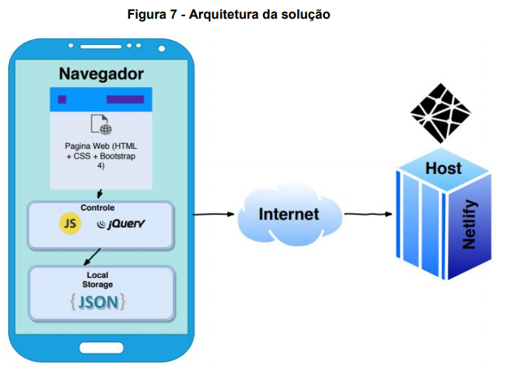
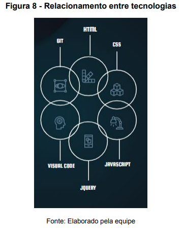

[Leitura anterior: Gerenciamento do Projeto](/docs/5-Gerenciamento-Projeto.md)

# Projeto da Solução

## Arquitetura da solução

Neste primeiro ciclo, o projeto passou pela implementação da interface
front-end, a interface da plataforma, é toda desenvolvida com a visão nos
requisitos definidos previamente, bem como no foco na interação do usuário
com o sistema.
Com o objetivo de tornar o desenvolvimento do projeto acessível, ao
qual cada pessoa possa trabalhar mesmo sem ter conhecimento avançado —
e ainda tornar esse desenvolvimento iterativo e incremental —, o projeto será
desenvolvido com as seguintes tecnologias:

- Camada de Visualização: HTML5, CSS e Bootstrap 4
- Camada de Controle: JavaScript e jQuery
- Persistência de dados: JSON e LocalStorage
- Hospedagem: Serviço de deploy automático do Netlify

A figura abaixo, representa a arquitetura da solução, do projeto **Van GO!**

De acordo com a definição do projeto, a plataforma é desenvolvida com
HTML + CSS e JavaScript, com a biblioteca do jQuery fazendo interação com
o HTML. Inicialmente o registro de dados, é feito de forma simples, sem o uso
de um banco de dados em si, os dados foram criados a partir de uma
definição de database local, onde os dados que devem ser manipulados,
estarão contidos em um arquivo .json. A interface será desenvolvida utilizando
como base os Wireframes criados e tem como objetivo possuir responsividade
em diferentes dispositivos.
A linguagem a ser utilizada será a linguagem JavaScript. Com o uso
dessa linguagem, será possível a construção de todo a parte lógica, a
manipulação dos dados, regras de negócio e chamadas de funções.
Inicialmente, será utilizado o serviço de nuvem da Netlify. Com esse serviço, será possível a hospedagem online gratuita da primeira versão do projeto,
possibilitando o acesso via internet. O framework de estilização utilizado será
o Bootstrap 4. Esse framework permite a criação de uma plataforma
responsiva, e com código organizado, sendo possível a execução tanto em
Desktop como no Mobile. Para auxiliar na manipulação do HTML, será
utilizada a biblioteca jQuery. Essa escolha foi feita com o intuito de facilitar os
scripts para a execução do navegador, assim como ter uma fácil
compreensão por parte da equipe, possibilitando o aprendizado mútuo. O
ambiente de desenvolvimento integrado (IDE) utilizado será o Visual Studio
Code, por já ser uma IDE que vem sendo usada em outras disciplinas do
curso, além de ser uma IDE intuitiva e simples de se trabalhar. Desta forma,
ocorre um relacionamento entre as tecnologias que acontece em momentos
como no ambiente de desenvolvimento integrado (Visual Studio Code), onde
jQuery interage com HTML — além do próprio CSS —, e o Bootstrap interage
diretamente com o HTML, através de elementos criados. A figura abaixo
mostra a interação entre essas tecnologias:

O relacionamento mostra como todas essas tecnologias estão ligadas, na
criação de um portal web responsivo.

[Próxima leitura: Testes](/docs/7-Testes.md)
